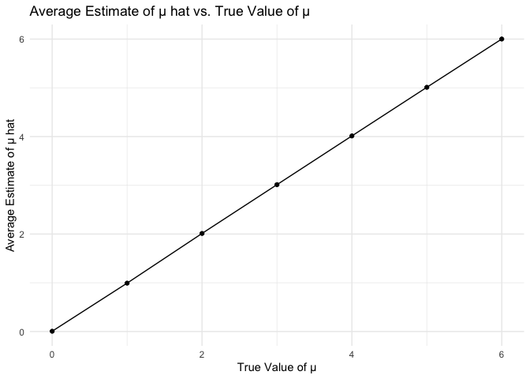
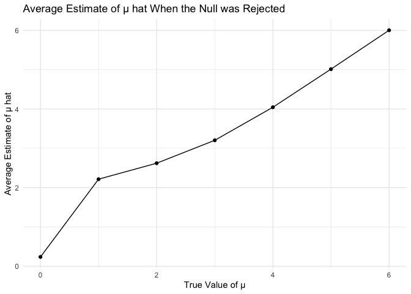

P8105 Homework 5
================
November 13, 2024

## Problem 1

Estimate birthday probabilities

``` r
bday_sim <- function(n) {
  bdays <- sample(1:365, size = n, replace = TRUE)
  duplicate <- length(unique(bdays)) < n
  return(duplicate)
}

birthday_match_prob <- function(size_range, simulations_count) {
  probabilities <- sapply(size_range, function(size) {
    results <- replicate(simulations_count, bday_sim(size))
    mean(results)
  })
  
  results <- tibble(
    group_size = size_range,
    probability = probabilities
  )
  
  return(results)
}
```

Run the simulation and plot results

``` r
group_sizes <- 2:50
simulations <- 10000

probability_data <- birthday_match_prob(group_sizes, simulations)

probability_data |> 
  ggplot(aes(x = group_size, y = probability)) +
  geom_line() +
  geom_point() +
  labs(
    title = "Probability of Shared Birthdays",
    x = "Group Size",
    y = "Probability"
  ) +
  theme_minimal()
```

<!-- -->

As group size increases the probability of shared birthdays also
increases. For around 23 people, the probability of at least two people
sharing a birthday exceeds 50%.

## Problem 2

First set the design elements: Sample Size: n \<- 30  
Standard Deviation: sigma \<- 5  
True value of population mean: mu_values \<- 0:6  
Number of simulations per mu value: iterations \<- 5000  
Significance level for the t-test: alpha \<- 0.05

Define sim power

``` r
sim_power <- function(samp_size = 30, true_mean = 0, true_sd = 5, alpha = 0.05) {
  sim_df <- tibble(
    x = rnorm(samp_size, true_mean, true_sd)
  )
    out_df <- sim_df %>%
    summarize(
      mu_hat = mean(x),  
      p_value = t.test(x, mu = 0) %>% broom::tidy() %>% pull(p.value)
    )
  return(out_df)
}
```

Run 5000 simulations

``` r
sim_final <- expand_grid(
  true_mean = c(0, 1, 2, 3, 4, 5, 6),  
  iter = 1:5000                      
) %>%
  mutate(
    samp_res = map(true_mean, sim_power, samp_size = 30)  
  ) %>%
  unnest(samp_res)
```

Plotting the Average Estimate of μ

``` r
sim_final %>%
  group_by(true_mean) %>%
  summarize(avg_mu_hat = mean(mu_hat), .groups = 'drop') %>%
  ggplot(aes(x = true_mean, y = avg_mu_hat)) +
  geom_point() +
  geom_line() +
  labs(
    title = "Average Estimate of μ hat vs. True Value of μ",
    x = "True Value of μ",
    y = "Average Estimate of μ hat"
  ) +
  theme_minimal()
```

<!-- -->

This graph demonstrates that as the true value of 𝜇increases, the
average estimate closely follows the true value of 𝜇.The diagonal line
indicates that, on average, 𝜇^ is an unbiased estimate of 𝜇, regardless
of the magnitude of 𝜇. This reflects that the estimator for μ performs
well and is consistent as the true value of 𝜇increases.

Plot the average estimate of mu where the null hypothesis was rejected

``` r
sim_final %>%
  filter(p_value < 0.05) %>%  
  group_by(true_mean) %>%
  summarize(avg_mu_hat_rejected = mean(mu_hat), .groups = 'drop') %>%
  ggplot(aes(x = true_mean, y = avg_mu_hat_rejected)) +
  geom_point() +
  geom_line() +
  labs(
    title = "Average Estimate of μ hat When the Null was Rejected",
    x = "True Value of μ",
    y = "Average Estimate of μ hat"
  ) +
  theme_minimal()
```

<!-- -->

This plot shows that the average 𝜇^ is only calculated for cases where
the null hypothesis was rejected (where p \<0.05). This plot shows a
similar trend to the first, but as the true 𝜇increases, the power of the
test increases, meaning that 𝜇^ values where the null is rejected will
be closer to the true value of 𝜇more often. This suggests that when
there is a true effect (μ\>0), the t-test is likely to reject the null
hypothesis, and the observed estimates 𝜇^ will be more representative of
the true effect size.
