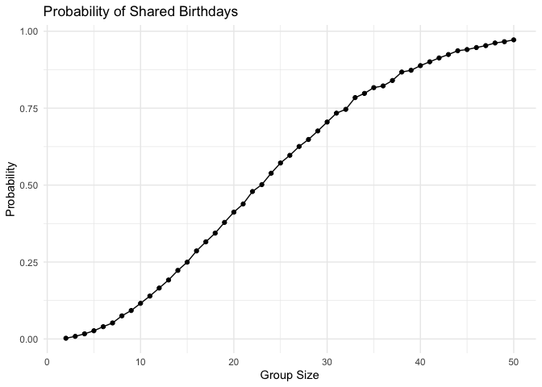

P8105 Homework 5
================
November 13, 2024

## Problem 1

Estimate birthday probabilities

``` r
bday_sim <- function(n) {
  bdays <- sample(1:365, size = n, replace = TRUE)
  duplicate <- length(unique(bdays)) < n
  return(duplicate)
}

birthday_match_prob <- function(size_range, simulations_count) {
  probabilities <- sapply(size_range, function(size) {
    results <- replicate(simulations_count, bday_sim(size))
    mean(results)
  })
  
  results <- tibble(
    group_size = size_range,
    probability = probabilities
  )
  
  return(results)
}
```

Run the simulation and plot results

``` r
group_sizes <- 2:50
simulations <- 10000

probability_data <- birthday_match_prob(group_sizes, simulations)

probability_data |> 
  ggplot(aes(x = group_size, y = probability)) +
  geom_line() +
  geom_point() +
  labs(
    title = "Probability of Shared Birthdays",
    x = "Group Size",
    y = "Probability"
  ) +
  theme_minimal()
```

<!-- -->

As group size increases the probability of shared birthdays also
increases. For around 23 people, the probability of at least two people
sharing a birthday exceeds 50%.
